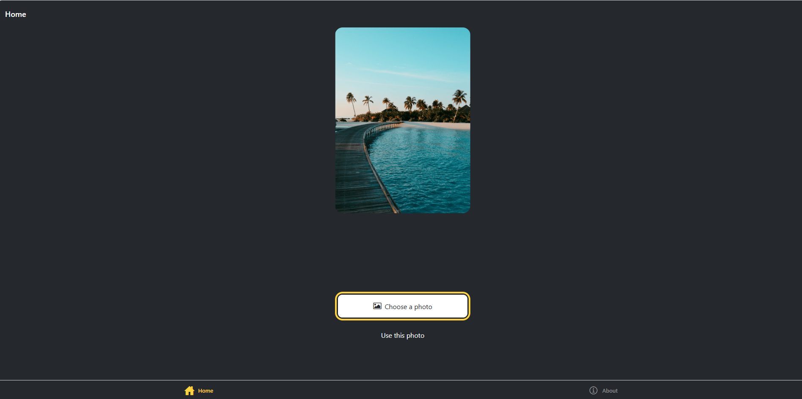
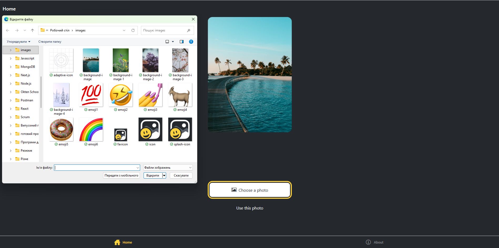
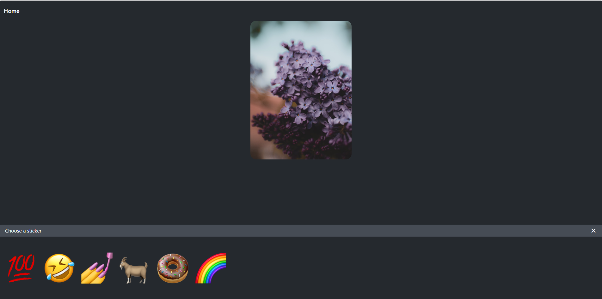
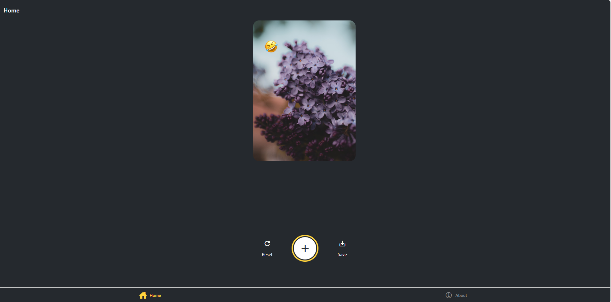
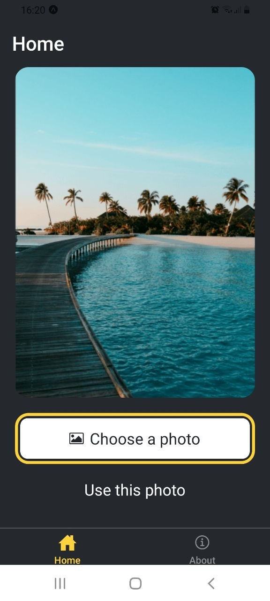
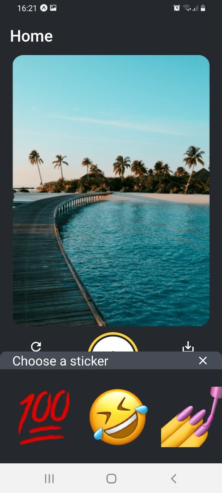
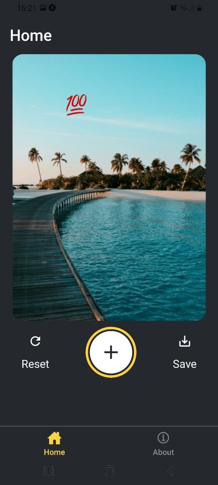
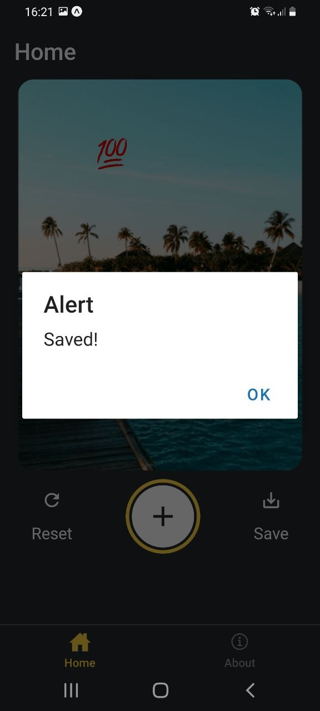

# Sticker Smash — React Native (Expo) Pet Project

This is a cross-platform mobile application developed as part of my learning path in React Native.

## Features
* **Image Selection:** Users can pick a photo from their device's media library using `expo-image-picker`.
* **Sticker Interaction:** Built a custom emoji picker modal and integrated stickers.
* **Gestures & Animations:** Implemented drag (Pan) and scale (Pinch) gestures using `react-native-gesture-handler` and `react-native-reanimated`.
* **Platform Specifics:** Handled differences between Web and Mobile (Android/iOS) for saving images.
* **Screenshot & Save:** Capturing the final composition and saving it to the device's gallery or downloading it via browser.

## Tech Stack
* **Framework:** React Native (Expo)
* **Navigation:** Expo Router (File-based routing)
* **Styling:** StyleSheet
* **Animations:** Reanimated
* **Language:** TypeScript

## Screenshots (Web Browser)
Here is the step-by-step process of creating and saving a sticker smash composition on a web browser.

  <table style="border-collapse: collapse; border: none;">
    <tr>
      <td style="border: none;"></td>
      <td style="border: none;"></td>
      <td style="border: none;"></td>
      <td style="border: none;"></td>
    </tr>
  </table>

## Screenshots (Mobile Demo)

Here is the step-by-step process of creating and saving a sticker smash composition on an Android device.

  <table style="border-collapse: collapse; border: none;">
    <tr>
      <td style="border: none;"></td>
      <td style="border: none;"></td>
      <td style="border: none;"></td>
      <td style="border: none;"></td>
    </tr>
  </table>

## How to Run
1. Clone the repository
2. Run `npm install`
3. Start the project with `npx expo start`